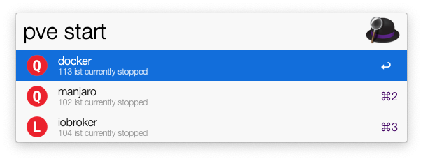

# ProxmoxControl (Alfred Workflow)

## Description

This [Alfred](https://www.alfredapp.com/)-workflow starts and stops virtual machines or LXC-containers (referred to as machines in the following text) in Proxmox.

## Usage

Just open Alfred and type `pve` to start the workflow. At this point, all machines running on Proxmox will be listet. Selecting an entry starts the machine (if it is stopped) and vice versa.

Providing the argument `start` will filter the list to all stopped machines, providing the argument `stop` all running machines are shown.

## Requirements

* You need to have [Alfred](https://www.alfredapp.com/) installed. And need you to [buy the Powerpack](https://buy.alfredapp.com/) to use the Workflow.
* Since macOS 12.3 (Monterey) [removed Python 2.7](https://developer.apple.com/documentation/macos-release-notes/macos-12_3-release-notes#Python), you have to [install it manually](https://www.alfredapp.com/help/kb/python-2-monterey/)
* You must be able to ssh into your [Proxmox](https://www.proxmox.com/en/proxmox-ve)-server (public key authentication). You should be aware of what this may implicate.

## Installation and Setup

Install the workflow in Alfred.

The following environment variables in Alfred must be set:

* `PROXMOX_USER`: the user name of the ssh-user
* `PROXMOX_HOST`: the ip/hostname of the Proxmox server
* `SSH_PORT`: the port where ssh is listening

Optional variables:

* `EXCLUDED_VMS`: comma-separated list of all machine-ids which should not be displayed in the result-list, in order to prevent the user from accidentally shutting down machines. 
  Example: `100,107,900`

## Comments, Pull-requests etc.

Any comments, suggestions, and contributions are appreciated.

## Licenses and thanks

This workflow uses the [Alfred-Workflow library](https://www.deanishe.net/alfred-workflow/index.html) from Dean Jackson.

The Proxmox Logo was taken from https://www.proxmox.com, https://www.proxmox.com/en/news/media-kit

The Workflow is released under [MIT](http://rem.mit-license.org/) LICENSE